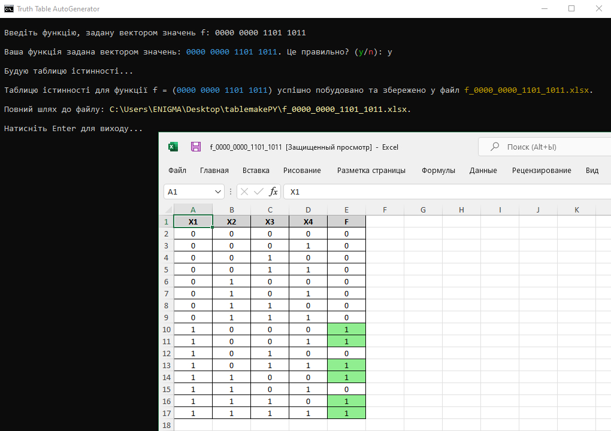

# ttag – Truth Table Auto Generator (Beta)


**Truth Table Auto Generator (.xlsx)** — це **python**-скрипт для автоматичної побудови таблиць істинності до функцій, заданих вектором значень, наприклад, типу **$f =$(0000 0000 1101 1011)**.  
Все що потрібно – це ввести вектор значень, після чого скрипт створить **.xlsx** файл з готовою таблицею істинності.



### Installation

```
git clone https://github.com/RadchenkoIhor/ttag.git
cd ttag
pip install -r requirements.txt
```

- Якщо у вас немає **Git** або ви не хочете його встановлювати, то можна [скачати архів вручну](https://github.com/RadchenkoIhor/ttag/archive/refs/heads/main.zip), але для коректної роботи скрипта, потрібно все одно встановити залежності, перераховані у **requirements.txt**.  
Можливо згодом додам навіть **Start.bat** для найлінивіших, щоб запускати скрипт double-click-ом.

### Usage

Don't forget `cd ttag` — if you're not already in  
  
**To run the script, use:**
```
python ttag.py
```
